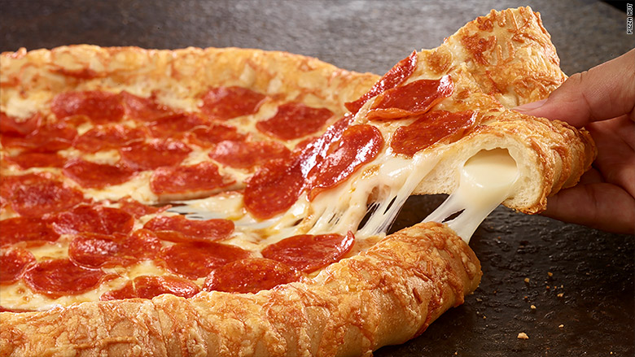
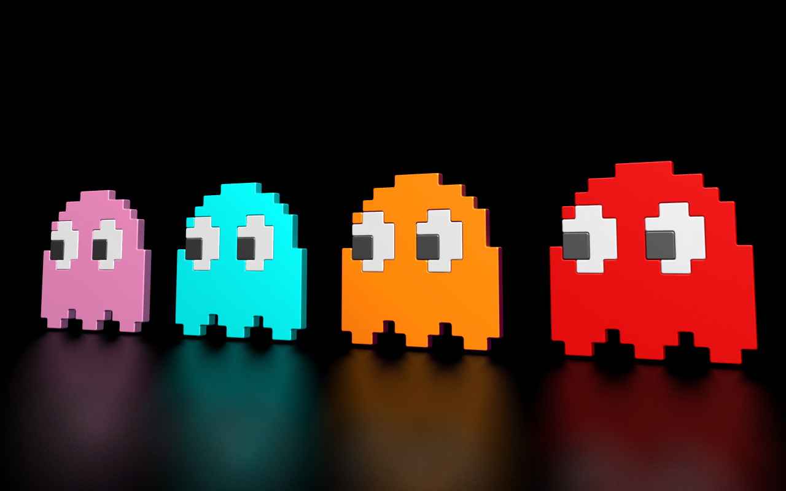

<html>
<title>my website</title>
  
<body>
  <h1>Welcome to my website!</h1>
  
this website is about me

  <h1>my favorite food is pizza</h1>
   
 

   <h1>hobbies</h1>
   
i like to play video games and racing 
   
 

   <a href= "Course_BOC.jpg"> 
   <h1>links</h1>
   <a href="www.youtube.com">
   
  <h1>
  <iframe width="560" height="315" src="a70319c58bfab6af917a59b9550d734a.jpg" frameborder="0" allowfullscreen></iframe>
   <iframe width="560" height="315" src="https://www.youtube.com/embed/teCorYNcqB8" frameborder="0" allowfullscreen></iframe>
 
  
</body>
</html>

